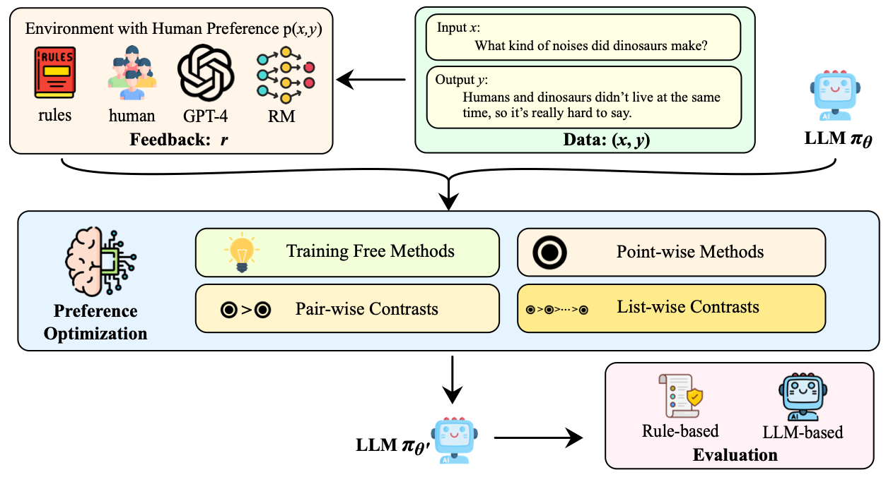
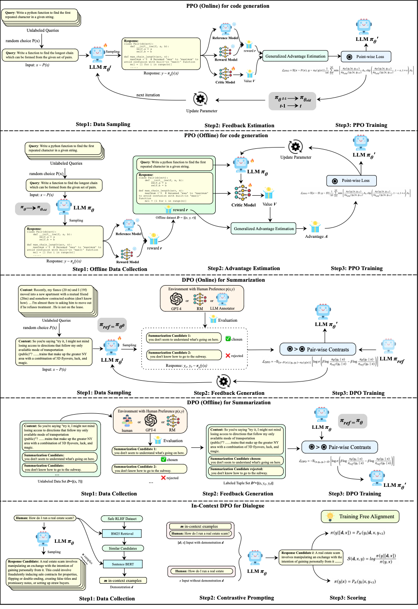
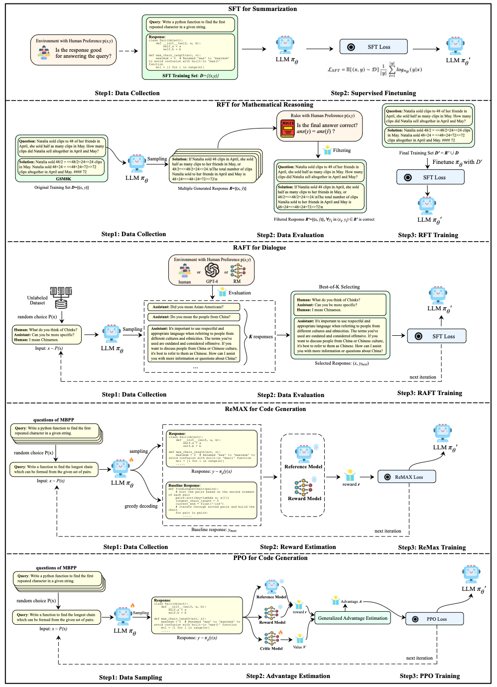

# 📢 Introduction
**Awesome-LLM-Preference-Learning**: The official repository of our survey paper: Towards a Unified View of Preference Learning for Large Language Models: A Survey.

This repo contains a curated list of [📙Awesome LLM Preference Learning Papers](#paperlist).




# 👉 Running Examples


# 📖 Paper List 
<div id="paperlist"></div>

## 1. Preference Data Collection 

### 1.1 On-Policy
#### Best-of-N sampling:

  [Reinforced Self-Training (ReST) for Language Modeling (2023.8)](https://arxiv.org/abs/2308.08998)

  [Statistical Rejection Sampling Improves Preference Optimization (2023.9)](https://arxiv.org/abs/2309.06657)

  [West-of-N: Synthetic Preference Generation for Improved Reward Modeling (2024.1)](https://arxiv.org/abs/2401.12086)

  [Regularized Best-of-N Sampling to Mitigate Reward Hacking for Language Model Alignment (2024.6)](https://arxiv.org/abs/2404.01054)

#### Monte-Carlo Tree Search based Methods:
  > MCTS-based methods are commonly found in tasks involving complex reasoning, making them particularly promising for applications in mathematics, code generation, and general reasoning.
  
  [Alphazero-like Tree-Search can Guide Large Language Model Decoding and Training (2023.9)](https://arxiv.org/abs/2309.17179)

  [Math-Shepherd: Verify and Reinforce LLMs Step-by-step without Human Annotations (2023.12)](https://arxiv.org/abs/2312.08935)

  [Improve Mathematical Reasoning in Language Models by Automated Process Supervision (2024.6)](https://arxiv.org/abs/2406.06592)

  [ReST-MCTS*: LLM Self-Training via Process Reward Guided Tree Search (2024.6)](https://arxiv.org/abs/2406.03816)

  [Accessing GPT-4 level Mathematical Olympiad Solutions via Monte Carlo Tree Self-refine with LLaMa-3 8B (2024.6)](https://arxiv.org/abs/2406.07394)

  [Recovering Mental Representations from Large Language Models with Markov Chain Monte Carlo (2024.6)](https://arxiv.org/abs/2401.16657)

  [Mutual Reasoning Makes Smaller LLMs Stronger Problem-Solvers (2024.8)](https://arxiv.org/abs/2408.06195)

### 1.2 Off-Policy
> Off-Policy data is usually the datasets related to preference alignment, which can be found in [RewardBench](https://arxiv.org/pdf/2403.13787). Preference data for training the reward model can also be used for preference learning.

## 2. Feedbacks
### 2.1 Direct Feedback
  [Scaling Relationship on Learning Mathematical Reasoning with Large Language Models (2023.8) -- Answer Equivalence](https://arxiv.org/abs/2308.01825)

  [DeepSeek-Prover: Advancing Theorem Proving in LLMs through Large-Scale Synthetic Data (2024.5) -- LEAN Feedback](https://arxiv.org/abs/2405.14333)

  [DeepSeek-Prover-V1.5: Harnessing Proof Assistant Feedback for Reinforcement Learning and Monte-Carlo Tree Search -- LEAN Feedback](https://arxiv.org/abs/2408.08152)

  [Contrastive Preference Optimization: Pushing the Boundaries of LLM Performance in Machine Translation -- QE Metric](https://arxiv.org/abs/2401.08417)

  [PanGu-Coder2: Boosting Large Language Models for Code with Ranking Feedback (2023.7) -- Unit Test](https://arxiv.org/abs/2307.14936)

  [RLTF: Reinforcement Learning from Unit Test Feedback (2023.7) -- Unit Test](https://arxiv.org/abs/2307.04349)

  [StepCoder: Improve Code Generation with Reinforcement Learning from Compiler Feedback (2024.2) -- Compiler](https://arxiv.org/abs/2402.01391)

  [Aligning LLM Agents by Learning Latent Preference from User Edits (2024.4) -- User](https://arxiv.org/abs/2404.15269)


### 2.2 Model-based Feedback
#### 2.2.1 Reward Model
  [RLAIF vs. RLHF: Scaling Reinforcement Learning from Human Feedback with AI Feedback (2023.9)](https://arxiv.org/abs/2309.00267)

  [Regularized Best-of-N Sampling to Mitigate Reward Hacking for Language Model Alignment (2024.4)](https://arxiv.org/abs/2404.01054)

  [West-of-N: Synthetic Preference Generation for Improved Reward Modeling (2024.1)](https://arxiv.org/abs/2401.12086)

  [Reward Model Ensembles Help Mitigate Overoptimization (2023.10)](https://arxiv.org/abs/2310.02743)

  [Uncertainty-Penalized Reinforcement Learning from Human Feedback with Diverse Reward LoRA Ensembles (2023.12)](https://arxiv.org/abs/2401.00243)

  [WARM: On the Benefits of Weight Averaged Reward Models (2024.1)](https://arxiv.org/abs/2401.12187)

  [Improving Reinforcement Learning from Human Feedback with Efficient Reward Model Ensemble (2024.1)](https://arxiv.org/abs/2401.16635)

  [Solving math word problems with process- and outcome-based feedback (2022.11)](https://arxiv.org/abs/2211.14275)

  [Fine-Grained Human Feedback Gives Better Rewards for Language Model Training (2023.6)](https://arxiv.org/abs/2306.01693)

  [Let's Verify Step by Step (2023.5)](https://arxiv.org/abs/2305.20050)

  [OVM, Outcome-supervised Value Models for Planning in Mathematical Reasoning (2023.11)](https://arxiv.org/abs/2311.09724)

  [Math-Shepherd: Verify and Reinforce LLMs Step-by-step without Human Annotations (2023.12)](https://arxiv.org/abs/2312.08935)

  [Prior Constraints-based Reward Model Training for Aligning Large Language Models (2024.4)](https://arxiv.org/abs/2404.00978)

  [Improve Mathematical Reasoning in Language Models by Automated Process Supervision (2024.6)](https://arxiv.org/abs/2406.06592)

#### 2.2.2 Pairwise Scoring
  [PandaLM: An Automatic Evaluation Benchmark for LLM Instruction Tuning Optimization (2023.6)](https://arxiv.org/abs/2306.05087)

  [LLM-Blender: Ensembling Large Language Models with Pairwise Ranking and Generative Fusion (2023.7)](https://arxiv.org/abs/2306.02561)


#### 2.2.3 LLM-as-a-Judge

  [Self-Rewarding Language Models (2024.1)](https://arxiv.org/abs/2401.10020)


  [LLM Critics Help Catch LLM Bugs (2024.6)](https://arxiv.org/abs/2407.00215)

  [Meta-Rewarding Language Models: Self-Improving Alignment with LLM-as-a-Meta-Judge (2024.7)](https://arxiv.org/abs/2407.19594)

  [Generative Verifiers: Reward Modeling as Next-Token Prediction (2024.8)](https://arxiv.org/abs/2408.15240)

## 3. Algorithms
### 3.1 Pointwise Methods


  [STaR: Bootstrapping Reasoning With Reasoning (2022.5)](https://arxiv.org/abs/2203.14465)

  [RAFT: Reward rAnked FineTuning for Generative Foundation Model Alignment (2023.4)](https://arxiv.org/abs/2304.06767)

  [Scaling Relationship on Learning Mathematical Reasoning with Large Language Models (2023.8)](https://arxiv.org/abs/2308.01825)

  [Proximal Policy Optimization Algorithms (2017.7)](https://arxiv.org/abs/1707.06347)

  [DeepSeekMath: Pushing the Limits of Mathematical Reasoning in Open Language Models (2024.2)](https://arxiv.org/abs/2402.03300)

  [ReMax: A Simple, Effective, and Efficient Reinforcement Learning Method for Aligning Large Language Models (2023.10)](https://arxiv.org/abs/2310.10505)

  [KTO: Model Alignment as Prospect Theoretic Optimization (2024.2)](https://arxiv.org/abs/2402.01306)
### 3.2 Pairwise Contrasts
  [Chain of Hindsight Aligns Language Models with Feedback (2023.2)](https://arxiv.org/abs/2302.02676)

  [Calibrating Sequence likelihood Improves Conditional Language Generation (2022.9)](https://arxiv.org/abs/2210.00045)

  [Direct Preference Optimization: Your Language Model is Secretly a Reward Model (2023.5)](https://arxiv.org/abs/2305.18290)

  [A General Theoretical Paradigm to Understand Learning from Human Preferences (2023.10)](https://arxiv.org/abs/2310.12036)
  
  [Direct Alignment of Language Models via Quality-Aware Self-Refinement (2024.5)](https://arxiv.org/abs/2405.21040)
  
  [ORPO: Monolithic Preference Optimization without Reference Model (2024.3)](https://arxiv.org/abs/2403.07691)

  [Mallows-DPO: Fine-Tune Your LLM with Preference Dispersions (2024.5)](https://arxiv.org/abs/2405.14953)

  [Group Robust Preference Optimization in Reward-free RLHF (2024.5)](https://arxiv.org/abs/2405.20304)

  [Smaug: Fixing Failure Modes of Preference Optimisation with DPO-Positive (2024.2)](https://arxiv.org/abs/2402.13228)

  [Beyond Reverse KL: Generalizing Direct Preference Optimization with Diverse Divergence Constraints (2023.9)](https://arxiv.org/abs/2309.16240)

  [Towards Efficient Exact Optimization of Language Model Alignment (2024.2)](https://arxiv.org/abs/2402.00856)

  [SimPO: Simple Preference Optimization with a Reference-Free Reward (2024.5)](https://arxiv.org/abs/2405.14734)

  [sDPO: Don't Use Your Data All at Once (2024.3)](https://arxiv.org/abs/2403.19270)

  [Learn Your Reference Model for Real Good Alignment (2024.4)](https://arxiv.org/abs/2404.09656)

  [Statistical Rejection Sampling Improves Preference Optimization (2023.9)](https://arxiv.org/abs/2309.06657)

  [Controllable Preference Optimization: Toward Controllable Multi-Objective Alignment (2024.2)](https://arxiv.org/abs/2402.19085)

  [MAPO: Advancing Multilingual Reasoning through Multilingual Alignment-as-Preference Optimization (2024.1)](https://arxiv.org/abs/2401.06838)
  
  [KnowTuning: Knowledge-aware Fine-tuning for Large Language Models (2024.2)](https://arxiv.org/abs/2402.11176)

  [TS-Align: A Teacher-Student Collaborative Framework for Scalable Iterative Finetuning of Large Language Models (2024.5)](https://arxiv.org/abs/2405.20215)

  [Beyond One-Preference-Fits-All Alignment: Multi-Objective Direct Preference Optimization (2023.10)](https://arxiv.org/abs/2310.03708)

  [Hybrid Preference Optimization: Augmenting Direct Preference Optimization with Auxiliary Objectives(2024.5)](https://arxiv.org/abs/2405.17956)

### 3.3 Listwise Contrasts
  [RRHF: Rank Responses to Align Language Models with Human Feedback without tears (2023.4)](https://arxiv.org/abs/2304.05302)

  [Preference Ranking Optimization for Human Alignment (2023.6)](https://arxiv.org/abs/2306.17492)

  [CycleAlign: Iterative Distillation from Black-box LLM to White-box Models for Better Human Alignment (2023.10)](https://arxiv.org/abs/2310.16271)

  [Making Large Language Models Better Reasoners with Alignment (2023.9)](https://arxiv.org/abs/2309.02144)

  [Don't Forget Your Reward Values: Language Model Alignment via Value-based Calibration (2024.2)](https://arxiv.org/abs/2402.16030)

  [LiPO: Listwise Preference Optimization through Learning-to-Rank (2024.2)](https://arxiv.org/abs/2402.01878)

  [LIRE: listwise reward enhancement for preference alignment (2024.5)](https://arxiv.org/abs/2405.13516)
### 3.4 Training-Free Methods
  [Black-Box Prompt Optimization: Aligning Large Language Models without Model Training (2023.11)](https://arxiv.org/abs/2311.04155)

  [The Unlocking Spell on Base LLMs: Rethinking Alignment via In-Context Learning (2023.12)](https://arxiv.org/abs/2312.01552)

  [ICDPO: Effectively Borrowing Alignment Capability of Others via In-context Direct Preference Optimization (2024.2)](https://arxiv.org/abs/2402.09320)

  [Aligner: Efficient Alignment by Learning to Correct (2024.2)](https://arxiv.org/abs/2402.09320)

  [RAIN: Your Language Models Can Align Themselves without Finetuning (2023.9)](https://arxiv.org/abs/2309.07124)

  [Reward-Augmented Decoding: Efficient Controlled Text Generation With a Unidirectional Reward Model (2023.10)](https://arxiv.org/abs/2310.09520)

  [Controlled Decoding from Language Models (2023.10)](https://arxiv.org/abs/2310.17022)

  [DeAL: Decoding-time Alignment for Large Language Models (2024.2)](https://arxiv.org/abs/2402.06147)

  [Decoding-time Realignment of Language Models (2024.2)](https://arxiv.org/abs/2402.02992)
## 4. Evaluation
### 4.1 Rule Based
> Rule-based benchmarks are traditional benchmarks that span various domains such as reasoning, translation, dialogue, question-answering, code generation, and more. We won't list them all individually.
### 4.2 LLM based
  [G-Eval: NLG Evaluation using GPT-4 with Better Human Alignment (2023.3)](https://arxiv.org/abs/2303.16634)

  [Automated Evaluation of Personalized Text Generation using Large Language Models (2023.10)](https://arxiv.org/abs/2310.11593)

  [Multi-Dimensional Evaluation of Text Summarization with In-Context Learning (2023.6)](https://arxiv.org/abs/2306.01200)

  [Large Language Models Are State-of-the-Art Evaluators of Translation Quality (2023.2)](https://arxiv.org/abs/2302.14520)

  [Large Language Models are not Fair Evaluators (2023.5)](https://arxiv.org/abs/2305.17926)

  [Generative Judge for Evaluating Alignment (2023.10)](https://arxiv.org/abs/2310.05470)

  [Judging LLM-as-a-Judge with MT-Bench and Chatbot Arena (2023.6)](https://arxiv.org/abs/2306.05685)

  [Prometheus: Inducing Fine-grained Evaluation Capability in Language Models (2023.10)](https://arxiv.org/abs/2310.08491)

  [PandaLM: An Automatic Evaluation Benchmark for LLM Instruction Tuning Optimization (2023.6)](https://arxiv.org/abs/2306.05087)

  [PRD: Peer Rank and Discussion Improve Large Language Model based Evaluations (2023.7)](https://arxiv.org/abs/2307.02762)

  [Evaluating Large Language Models at Evaluating Instruction Following (2023.10)](https://arxiv.org/abs/2310.07641)

  [Wider and Deeper LLM Networks are Fairer LLM Evaluators (2023.8)](https://arxiv.org/abs/2308.01862)


# 🌟Contribute
Welcome to star & submit a PR to this repo! 


# 📝 Citation
```
{
  Coming Soon
}
```